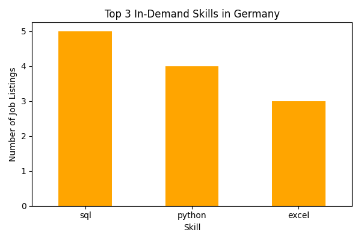
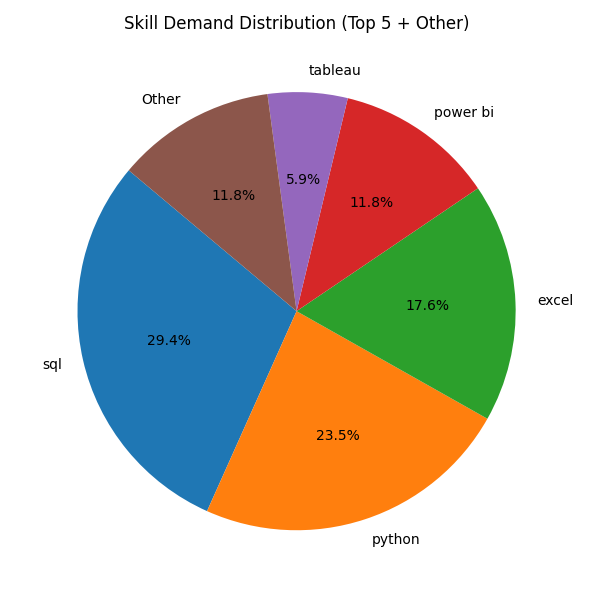
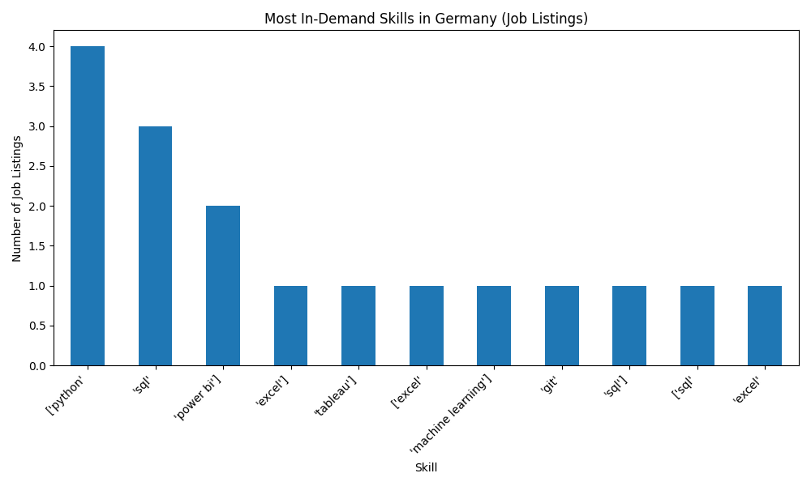

>> Job Market Data Analysis (Germany)

This project analyzes German job market data using Python to identify in-demand technical skills, with a focus on working student and entry-level roles.

Skills Demonstrated
- Data cleaning with pandas and NumPy
- Exploratory data analysis (EDA)
- Python vs SQL demand analysis
- Working student vs full-time role comparison
- Data visualization using matplotlib

Key Insights
- Percentage of jobs requiring Python and SQL
- Most in-demand technical skills
- Number of working student positions in the dataset

Project Structure
- `data/` – raw and cleaned job listings data
- `python/` – data cleaning, analysis, and visualization scripts
- `charts/` – generated skill demand chart

Charts

**Top 3 Most In-Demand Skills**  

**(Top 5 + Other)**  

**Most Demanding Skills**  

